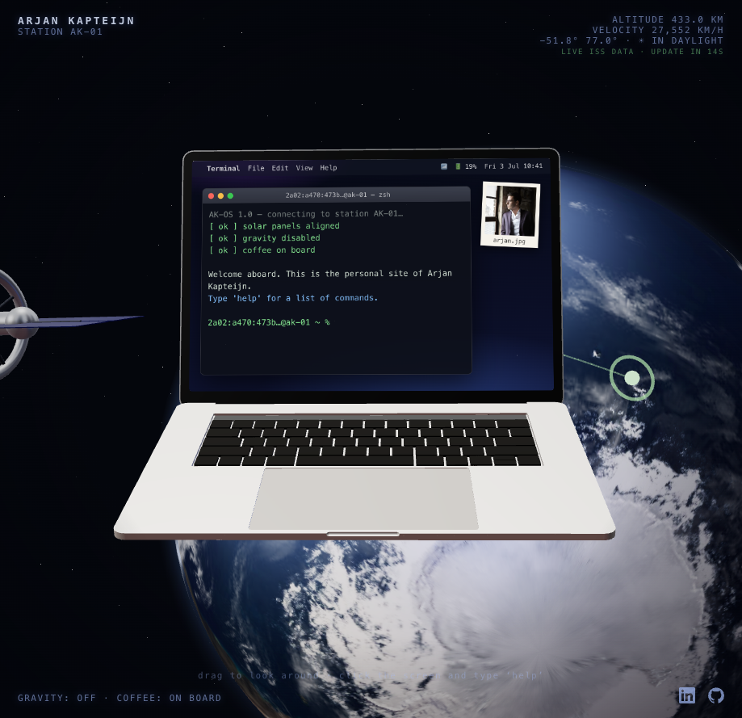

# arjankapteijn.nl / arjankapteijn.com

Persoonlijke site van Arjan Kapteijn: een zwevende MacBook in een baan om de
aarde, met een interactieve terminal die bezoekers zelf kunnen bedienen.
De HUD toont **live telemetrie van het echte ISS** en de site is tweetalig
(Nederlands op `.nl`, Engels op `.com`).

*Personal site of Arjan Kapteijn - a floating MacBook in low Earth orbit with
an interactive terminal. Dutch on `.nl`, English on `.com`.*

[](https://github.com/arjankapteijn/website/actions/workflows/ci.yml)
[](https://github.com/arjankapteijn/website/actions/workflows/docker-publish.yml)
[](https://github.com/arjankapteijn/website/tags)




## Stack

| Onderdeel | Technologie |
|---|---|
| Build & dev server | [Vite](https://vite.dev) + TypeScript |
| UI | React 19 |
| 3D | [Three.js](https://threejs.org) via [@react-three/fiber](https://github.com/pmndrs/react-three-fiber) + [@react-three/drei](https://github.com/pmndrs/drei) |
| Terminal op het scherm | drei `<Html transform occlude>` + eigen React-component |
| Live ISS-data | [wheretheiss.at API](https://wheretheiss.at/w/developer) (satelliet 25544, geen key nodig) |
| E-mail | server-side via [SMTP2GO](https://www.smtp2go.com) (`server/smtp.js`, zero-dependency); fallback `mailto:` |
| Scheepslogboek | getypte commando's als Signal-push via [signal-cli-rest-api](https://github.com/bbernhard/signal-cli-rest-api) (`server/signal.js`), met grove herkomst per IP via [ip-api.com](https://ip-api.com) (`server/geo.js`) |
| IP-lookup | [api64.ipify.org](https://www.ipify.org) (client-side, eenmalig per sessie) - haalt het publieke IP van de bezoeker op voor de terminalprompt en het scheepslogboek |
| Zonnepanelen | live vermogen van de echte zonnepanelen via [SolarEdge Monitoring API](https://monitoring.solaredge.com) (`server/server.js` → `/api/solar`, gecachet), getoond als accuicoontje in de menubalk; klikbaar voor uitgebreide dagoverzicht-modal |
| Serverstatus | live cpu/geheugengebruik van de host, rechtstreeks via `/proc` (`server/host.js` → `/api/host`, geen cloud-API/key), getoond als Activity Monitor-icoontje in de menubalk; klikbaar voor specs + live cijfers |
| Hosting | Docker-container op TrueNAS, beheerd via [Arcane](https://github.com/getarcaneapp/arcane), achter Nginx Proxy Manager (Let's Encrypt) |

Alle assets (3D-model, textures, DRACO-decoder, HDR) worden lokaal geserveerd.
Runtime-afhankelijkheden van externe API's: ISS-telemetrie (wheretheiss.at),
IP-lookup (api64.ipify.org) en server-side geo-lookup (ip-api.com).

## Terminal-commando's

Klik op het MacBook-scherm en typ:

| Commando | Doet |
|---|---|
| `help` | lijst met commando's |
| `about` / `bio` | wie is Arjan? |
| `whoami` | naam + titel |
| `skills` | vaardigheden |
| `email` | stuur een e-mail vanuit de terminal (onderwerp → bericht → optioneel antwoordadres → bevestigen; verzonden via SMTP2GO) |
| `photo` / `open arjan.jpg` | opent de foto op het bureaublad |
| `linkedin` | opent het LinkedIn-profiel |
| `iss` | live positie, hoogte en snelheid van het échte ISS |
| `lang en` / `lang nl` | wissel van taal (wordt onthouden) |
| `neofetch` | systeeminfo van deze MacBook (M1 Max 😉) |
| `date`, `pwd`, `ls`, `cat`, `echo` | doen wat je verwacht |
| `clear` | scherm leegmaken |
| `sudo …`, `exit` | probeer maar 😄 |

Pijltje omhoog/omlaag bladert door de commandogeschiedenis. De foto op het
bureaublad is ook direct aanklikbaar. Links in de terminaluitvoer (zoals
`vavox.nl` in `about`) zijn klikbaar; alleen `http(s)`- en `mailto:`-schema's
worden als link gerenderd, de rest blijft platte tekst (XSS-veilig).

## Ontwikkelen

```bash
npm install
npm run dev      # http://localhost:5173
npm run build    # productiebuild in dist/
npm run preview  # test de productiebuild lokaal
```

## Personaliseren

- **Identiteit & links** - `src/config.ts` (naam, e-mail, LinkedIn, foto-pad).
- **Teksten per taal** - `src/i18n.ts` (bio, titel, skills, alle UI- en
  terminalteksten; de TODO-markers wachten op echte content).
- **Foto** - `public/photo.webp` (vierkant, 800×800).
- **Terminal-commando's** - `src/components/Terminal.tsx`.
- **SEO & deelbaarheid** - `index.html` (meta-description, canonical,
  Open Graph + Twitter card, en `Person`-structured-data voor Google).

### Taaldetectie

`.nl`-domein → Nederlands, `.com`-domein → Engels. Daarbuiten (bijv. lokaal)
volgt de site de browsertaal. Overschrijven kan met `?lang=en|nl` in de URL
of het `lang`-commando in de terminal (opgeslagen in localStorage).

### Kiosk-modus (digibord e.d.)

`?macbook=off` verbergt het 3D-laptopmodel (en de bijbehorende hint-tekst),
zodat alleen de aarde met de live ISS-tracker in beeld blijft.

## Deployen (Docker + Arcane + Nginx Proxy Manager)

De site draait als kleine, gehardende Docker-container
([Dockerfile](Dockerfile) + [docker-compose.yml](docker-compose.yml)):
multi-stage build (geen node_modules in het eindimage), niet-root (de
ingebouwde `node`-user, uid 1000), `read_only` rootfs, alle capabilities
gedropt, `no-new-privileges`,
geheugen- en pids-limiet, en een healthcheck op `/healthz`.

**GitHub Actions** bouwt het image en pusht het als privé-image naar
**ghcr.io** (`ghcr.io/arjankapteijn/website`, zie
[docker-publish.yml](.github/workflows/docker-publish.yml)) bij elke push
naar `main` (zie "Versies / releases").

Zelf draait de site op TrueNAS SCALE als gewone Docker-container, beheerd
via [Arcane](https://github.com/getarcaneapp/arcane) - géén TrueNAS
"custom app". Compose en env-vars staan in Arcane's eigen projectmap op de
host; [docker-compose.yml](docker-compose.yml) hierboven is het portable
voorbeeld voor als je 'm zelf ergens anders (niet via Arcane) wil draaien.
Omdat het image privé is, moet de Docker-host één keer inloggen bij de
registry (PAT met scope `read:packages`):
`echo <TOKEN> | docker login ghcr.io -u arjankapteijn --password-stdin`.

### Updaten

Push naar `main` → nieuw `:latest`-image op ghcr.io. In Arcane pikt de
**Auto Update**-automation dat zelf op (Image Update Watcher pollt elk uur,
Auto Update past dagelijks toe) - of klik zelf op **Update** bij de
container. Lokaal de productieversie testen: `npm run build && npm start`
(→ http://localhost:8080).

### Achter Nginx Proxy Manager (Let's Encrypt)

1. NPM → **Hosts → Proxy Hosts → Add**:
   domains `arjankapteijn.nl, www.arjankapteijn.nl`,
   scheme `http`, forward host = IP van je TrueNAS, forward port `8090`
   (de host-poort uit `docker-compose.yml`).
   Vink **Block Common Exploits** aan (websockets niet nodig).
2. Tab **SSL**: *Request a new SSL certificate* (Let's Encrypt),
   **Force SSL** + **HTTP/2** aan.
3. Herhaal voor `arjankapteijn.com, www.arjankapteijn.com` (zelfde
   forward) - de site toont dan automatisch Engels.
4. DNS van beide domeinen → je publieke IP (A-record), en poort 80/443
   geforward naar NPM.

NPM stuurt `X-Forwarded-For` standaard mee, zodat de prompt en de
Signal-melding het echte bezoekers-IP zien.

### Versies / releases

**Releasen = gewoon pushen naar `main`.** De `docker-publish.yml`-workflow
doet de rest automatisch:

1. Leidt de volgende semver-tag af uit de commits sinds de laatste tag via
   **conventional commits**: `feat:` → minor, `!`/`BREAKING CHANGE` → major,
   anders patch.
2. Maakt de git-tag aan en pusht hem.
3. Maakt automatisch een **GitHub Release** aan met een changelog uit de
   commit-onderwerpen.
4. Bouwt en pusht het image naar ghcr.io met tags `:latest`, `:x.y.z`,
   `:x.y` en `:sha-<short>`.

Schrijf dus altijd **conventional commit-messages** (`feat:`, `fix:`,
`chore:`, `docs:`, `ci:`) - de versie-bump hangt daarvan af.
`package.json` hoef je **niet** te bumpen; de git-tag is de single source
of truth.

Doc-only pushes (`**.md`, `docs/**`) slaan versie-bump én image-build over.

Een handmatige `v*`-tag-push werkt ook en bouwt altijd.

| Scenario | Image-tags |
|---|---|
| Push naar `main` | `:latest`, `:x.y.z`, `:x.y`, `:sha-<short>` |
| Handmatige `v1.2.3`-tag | `:1.2.3`, `:1.2` |

De site draait bewust op `:latest`; Arcane's Update-knop/Auto Update pakt
vanzelf de nieuwste versie. Pinnen op een vaste tag (bijv. `:1.1.0`) is
mogelijk voor deterministisch rollback.

## Live ISS-data

De site gebruikt `https://api.wheretheiss.at/v1/satellites/25544` (gratis,
±1 request/seconde toegestaan; de site pollt elke 15 s):

- **HUD** - echte hoogte, snelheid, positie en of het ISS in het zonlicht
  of in de aardschaduw vliegt.
- **ISS-marker op de globe** - een pulserende groene reticle op de actuele
  positie, met een spoor van eerdere posities. De globe draait langzaam mee
  met het ISS, alsof station AK-01 ernaast meevliegt.
- **Echte zonnestand** - het zonlicht op de aarde volgt het sub-solaire punt
  (`solar_lat`/`solar_lon`), dus de dag/nacht-grens op de globe klopt met de
  werkelijkheid. De laptop heeft eigen sfeerverlichting (three.js layers),
  zodat die er altijd goed uitziet.
- **`iss`-commando** - live rapport in de terminal.

Valt de API weg, dan toont de HUD statische fallback-waarden en blijft de
globe in de laatste stand staan.

## E-mail via SMTP2GO

Het `email`-commando POST naar `/api/email`; `server/server.js` verstuurt
de mail via SMTP2GO (impliciete TLS, poort 465) naar `MAIL_TO`. Het
optionele antwoordadres van de bezoeker komt in de `Reply-To`-header,
dus beantwoorden werkt gewoon vanuit je mailprogramma. Configuratie via
`.env` (zie [.env.example](.env.example)); max. 4 mails per minuut per
IP. Zonder SMTP-configuratie (of op statische hosting) valt de terminal
automatisch terug op een `mailto:`-link.

**Let op:** het `MAIL_FROM`-domein moet in SMTP2GO als sender domain
geverifieerd zijn, en commit `.env` nooit (staat in `.gitignore`).

## Scheepslogboek (Signal)

Alles wat bezoekers in de terminal typen wordt als los **Signal-bericht**
gepusht via een zelf-gehoste [signal-cli-rest-api](https://github.com/bbernhard/signal-cli-rest-api).
`server/server.js` handelt `POST /api/log` af en stuurt via `server/signal.js`
een `POST /v2/send`. Berichtformaat:

```
[2026-06-12 11:42:07 UTC] 86.82.123.45 (nl) % neofetch
```

Hoe het werkt:

- **Config** (`.env`, zie [.env.example](.env.example)): `SIGNAL_API_URL`,
  `SIGNAL_NUMBER` (het geregistreerde afzendernummer) en optioneel
  `SIGNAL_RECIPIENTS` (komma-gescheiden; leeg = note-to-self). Ontbreekt de
  config, dan staat het logboek vanzelf uit (`501`, de client faalt stil).
- **Lokaal én productie** delen dezelfde `sendSignal()` (een Vite-plugin
  spiegelt in dev het productiegedrag). Max. 30 posts/minuut per IP.

**Privacy / AVG:** het volledige bezoekers-IP gaat **onverkort** mee in de
Signal-melding (bewuste keuze). E-mailinhoud (onderwerp/bericht) wordt
**nooit** gelogd. IP's + tijdstippen zijn persoonsgegevens, en de interface
meldt niet dát er gelogd wordt - vermeld dit dus zelf in een
privacyverklaring. Houd er rekening mee dat je hiermee bezoekers-IP's naar
een Signal-kanaal stuurt.

## Zonnepanelen (SolarEdge)

Het accuicoontje (🔋) in de menubalk toont het **live vermogen van de echte
zonnepanelen** als percentage van het piekvermogen (2,7 kWp). Klikken opent
een modal met vandaag-opbrengst, maandopbrengst en lifetime-totaal.

De data komt van de [SolarEdge Monitoring API](https://monitoring.solaredge.com)
via `/api/solar`. De server cachet de respons (standaard 15 min) om binnen de
gratis daglimiet van SolarEdge (~300 calls/dag) te blijven.

Configuratie via `.env` (zie [.env.example](.env.example)):

```env
SOLAREDGE_API_KEY=vul-hier-je-api-key-in
SOLAREDGE_SITE_ID=vul-hier-je-site-id-in
```

Zonder configuratie (of op statische hosting) blijft het accu-icoontje wel
klikbaar - de modal toont dan alleen de statische specs (omvormer, panelen),
met een melding dat live-cijfers niet beschikbaar zijn. E-mailinhoud wordt
nooit meegestuurd naar SolarEdge.

## Serverstatus (Activity Monitor)

Het icoontje (📊) naast de accu in de menubalk toont **live cpu-gebruik van de
machine die deze site host**. Klikken opent een modal (🏠) met ook geheugen-
en schijfgebruik (incl. uptime) achter de statische specs van de
homelab-machine (`hosting` in [src/config.ts](src/config.ts) - vul die zelf
in, incl. `storageTotalGb` voor het schijf-percentage).

Geen cloud-API, geen key: de server leest gewoon `/proc/stat`, `/proc/meminfo`
en `/proc/uptime`, zoals `top`/`htop` dat ook doen, en voor schijfruimte een
`statfs` op `DATA_DIR` (standaard `/data`, het volume dat er toch al is) -
ZFS geeft daarbij geen bruikbare totale pool-grootte terug (een bekende
eigenaardigheid: elke dataset toont zijn éígen "size"), dus alleen de
*beschikbare* ruimte komt live binnen; het totaal (`storageTotalGb`) is een
vaste spec, net als het cpu-model (`server/host.js` → `/api/host`, 15 sec.
gecachet). **Geen bind-mount nodig** op onze eigen
Arcane/Docker-setup: getest (2026-09) op de homelab-machine zelf - een gewone
container ziet daar zónder enige extra volume-config al de écht host-wide
cijfers (`MemTotal`/uptime in de container matchten exact `free -h` en
`/proc/uptime` op de host). Dat is geen garantie voor élke Docker-omgeving
(sommige zetten wel cgroup-limieten of lxcfs in), dus mocht het ergens anders
tóch nodig zijn: `HOST_PROC_STAT`/`HOST_PROC_MEMINFO`/`HOST_PROC_UPTIME`
laten een alternatief pad instellen (bv. na een read-only `/proc:/host-proc:ro`
bind-mount - niet rechtstreeks op `/proc` in de container mounten, dat
overschrijft 'm en kan de container breken).

Zonder werkende `/proc` (of lokaal op macOS, waar `/proc` niet bestaat) blijft
het icoontje wel klikbaar - de modal toont dan alleen de statische specs, met
een melding dat live-cijfers niet beschikbaar zijn.

## Credits & licenties

- **MacBook-model** - `mac-draco.glb` uit de officiële
  [pmndrs/examples](https://github.com/pmndrs/examples) (floating-laptop demo),
  CC-BY-4.0.
- **Aarde-textures** - uit de [three.js-voorbeelden](https://threejs.org/examples/)
  (gebaseerd op NASA Blue Marble-beeldmateriaal).
- **HDR-omgeving** - `potsdamer_platz_1k.hdr` via
  [pmndrs/drei-assets](https://github.com/pmndrs/drei-assets) (Poly Haven, CC0).
- **ISS-telemetrie** - [wheretheiss.at](https://wheretheiss.at).
